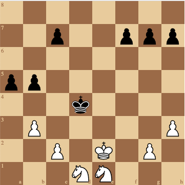

# uchess

> ♛♔ Play chess in your terminal.

<a href="https://github.com/tmountain/uchess/issues"></a>
<a href="https://github.com/tmountain/uchess/network"></a>
<a href="https://github.com/tmountain/uchess/blob/main/LICENSE"></a>
<a href="https://goreportcard.com/report/github.com/tmountain/uchess"></a>


## Introduction

**uchess** is an interactive terminal chess client designed to allow
gameplay and move analysis in conjunction with
[UCI chess engines](https://en.wikipedia.org/wiki/Universal_Chess_Interface).

**uchess** is highly configurable, fully themeable, and capable of
supporting a variety of play scenarios including human vs. human,
human vs. cpu, and cpu vs. cpu.

Games may be initialized via FEN notation and exported to PGN notation
for further analysis in third-party engines. Additionally, board
snapshots may be saved to SVG image format for the purpose of sharing
or archiving board state.

A hint engine is provided to assist players in discovering the best
move in a given scenario and game state may be walked backward on an
as-needed basis to facilitate game tree exploration.

Game moves are input as algebraic notation via an interactive command
shell, and a variety of auxillary commands are supported.

An example of a board snapshot:



## Installation

The easiest way to get **uchess** is via an
[official release](https://github.com/tmountain/uchess/releases).

**uchess** can also be installed using "go get".
A valid GOPATH is required to use the `go get` command.
If $GOPATH is not specified, $HOME/go will be used by default.

```bash
$ go get github.com/tmountain/uchess/cmd/uchess
```

## Build

**uchess** includes a Makefile which will build a binary
for your native architecture.

```bash
$ make build
$ cmd/uchess/uchess
```

You can also cross compile via `make release_test`.

```bash
$ make release_test
$ tree dist
dist
├── uchess_darwin_amd64
│   └── uchess
├── uchess_linux_amd64
│   └── uchess
├── uchess_linux_arm_5
│   └── uchess
└── uchess_windows_amd64
    └── uchess.exe
=======
go get -u github.com/tmountain/uchess/cmd/uchess
```

## Usage

### The easy way: zero configuration

With no arguments specified, uchess will attempt to locate stockfish
in your path and run it with difficulty level 20. 

If stockfish cannot be found, uchess provides for an automated installation
on Linux and Windows. Automated install for Mac is a work in progress.

### The manual way: generate a **uchess** config and edit it accordingly.

Mac and Linux

```bash
$ uchess -tmpl > uchess.json
```

Windows

```
# Avoid BOM in config file
> .\uchess.exe -tmpl | set-content uchess.json -Encoding Ascii
```

Run **uchess** on the config.

Mac and Linux

```bash
$ uchess -cfg uchess.json
```

Windows

```
> .\uchess.exe -cfg uchess.json
```


### Commands

**uchess** accepts commands via an interactive shell. The following commands
are supported.

```
  back           Walk the game state back one turn.
  save           Save the PGN for the current game in the CWD.
  image          Save an SVG snapshot of the current game in the CWD.
  fen            Display the FEN string for the current game.
  reset          Reset the board to the default FEN.
  resign         The current player resigns.
  hint           Highlight the recommended move using the hint engine.
  quit           Shutdown uchess immediately without saving game state.
```

If none of the previous commands are recognized, the input is assumed
to be a move specified in algebraic notation.

```
  Examples:
      e4         Pawn to e4.
      exd5       Pawn on the e-file captures the piece on d5.
      O-O        King castles on kingside.
      O-O-O      King castles on queenside.
      e8=Q       Pawn promotion to queen.
```

### Config Example

```json
{
  "uciWhite": "stockfish",
  "uciBlack": "stockfish",
  "uciHint": "stockfish",
  "uciEngines": [
    {
      "name": "stockfish",
      "engine": "/usr/games/stockfish",
      "hash": 128,
      "ponder": false,
      "ownBook": false,
      "multiPV": 4,
      "depth": 0,
      "searchMoves": "",
      "moveTime": 3000,
      "options": [
        {
          "name": "skill level",
          "value": "20"
        }
      ]
    }
  ],
  "fen": "rnbqkbnr/pppppppp/8/8/8/8/PPPPPPPP/RNBQKBNR w KQkq - 0 1",
  "activeTheme": "basic",
  "theme": [
    {
      "name": "basic",
      "moveLabelBg": "#d0d0d0",
      "moveLabelFg": "#000000",
      "squareDark": "#d78700",
      "squareLight": "#ffaf5f",
      "squareHigh": "#5fffaf",
      "squareHint": "#af87ff",
      "squareCheck": "#ff87d7",
      "white": "#eeeeee",
      "black": "#080808",
      "msg": "#d70000",
      "rank": "#9e9e9e",
      "file": "#9e9e9e",
      "prompt": "#d70000",
      "meterBase": "#585858",
      "meterMid": "#0",
      "meterNeutral": "#00d7ff",
      "meterWin": "#87ffd7",
      "meterLose": "#d75f5f",
      "playerNames": "#0",
      "score": "#9e9e9e",
      "moveBox": "#0",
      "emoji": "#0",
      "input": "#0",
      "advantage": "#9e9e9e"
    }
  ],
  "whitePiece": "human",
  "blackPiece": "cpu",
  "whiteName": "",
  "blackName": ""
}
```

### Base Config Format
When invoked with the -tmpl argument, uchess will generate a config with
a reasonable set of defaults. The config file is a JSON document with
the following top-level keys.

```
  uciWhite       Name of the UCI engine controlling white pieces.
  uciBlack       Name of the UCI engine controlling black pieces.
  uciHint        Name of the UCI engine providing hints.
  uciEngines     A list of available UCI engines (see UCI CONFIG FORMAT).
  fen            FEN notation specifying starting positions.
  activeTheme    The currently selected theme (list available via -themes).
  theme          A list of available themes (see THEMES).
  whitePiece     Player controlling the white pieces (cpu or human).
  blackPiece     Player controlling the black pieces (cpu or human).
  whiteName      Player name for white pieces in UI.
  blackName      Player name for black pieces in UI.
```

### UCI Config Format
The uchess config file may reference any number of UCI engines; however,
each engine must by identified by a unique name parameter. The following
keys are supported for UCI configuration.

```
  name           The unique UCI engine name.
  engine         The path to the UCI engine binary (OS dependent).
  hash           The value in MB for hash table memory.
  ponder         Allow or disallow the engine to ponder.
  ownBook        Specifies whether the engine has its own opening book.
  multiPV        The engine supports multi best line or k-best mode.
  depth          Search x plies only. A setting of 0 specifies unlimited plies.
  searchMoves    Restrict search to moves specified (i.e., "e2e4 d2d4").
  moveTime       Search exactly x mseconds.
  options        Key-value pairs for arbitrary engine commands.
```

### Themes
uchess is fully themeable, and user specified themes may be added to the
uchess config file. The theme keys are named in a manner which is intended to
be self-explanatory, and colors are specified by their respective hex
values. It is recommended to limit colors to the spectrum supported by
your terminal. xterm-256 (8-bit color) is the official standard for
builtin themes.

The builtin themes are packaged into the uchess binary using Golang's embed package. New themes should be added to the [themes project directory](/themes).

Pull requests for new builtin themes are welcome; however, the specified
colors must fall under the xterm-256 standard. A color chart is available
[here](https://en.wikipedia.org/wiki/Xterm#/media/File:Xterm_256color_chart.svg).

Builtin themes should be specified on a one theme per file basis, and all
themes should be specified in JSON format and reside in the themes directory.

When a name collision occurs, themes specified in the config file will
override builtin themes.

Lastly, a special hex code of #0 is used to specify the terminal default
color. This code should be used for any UI elements that may collide with
an underlying color scheme (i.e., avoiding white fonts on white backgrounds).

### Game Outcomes
**uchess** can effectively identify a wide variety of game outcomes, and it should
account for the following end-game scenarios:

```
    Checkmate
    Stalemate
    Resignation (manual)
    Threefold Repetition
    Fivefold Repetition
    Fifty Move Rule
    Seventy Five Move Rule
    Insufficient Material
```

### CPU Matches
If the uchess config specifies both whitePiece and blackPiece as cpu,
the specified UCI engines will play against each other. The game will
cycle forward one move each time tne enter key is pressed.

### Platform Support
**uchess** has been tested and confirmed to work on Linux, MacOS, and Windows
(PowerShell) platforms. It should work with a wide variety of terminals.

### Project Status
**uchess** is currently in unstable (alpha) status, and its internal APIs
are subject to change. Efforts will be made to keep the config file and
theme format stable going forward to the extent that it is practical to do so.

### Bugs
Some UCI chess engines currently fail due to a lack of proper initialization.
This will be resolved in a future release. For the moment, stockfish is the
only UCI engine that is officially supported.

### Special Thanks
**uchess** depends on the [notnil/chess](https://github.com/notnil/chess),
and [freeve/uci](https://github.com/freeeve/uci), and
[gdamore/tcell](https://github.com/gdamore/tcell) modules.
Many thanks to the maintainers.

Lastly, **uchess** is heavily inspired by [nickzuber/chs](https://github.com/nickzuber/chs).
